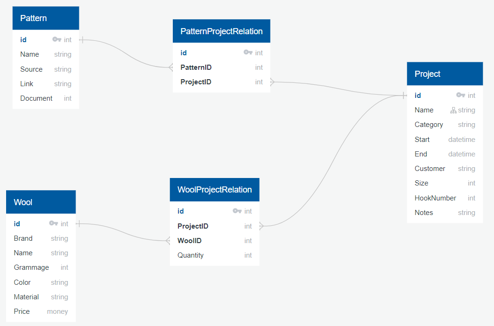

# Crochet Library

Projet en cours de réalisation...
Accessible via le lien Vercel dans la section "About".

## Introduction
Pourquoi ce projet ?
Je cherchais une idée de projet me permettant d'aborder différentes notions back et front telles que : bases de données, CRUD, API, framework, ...

Le crochet est l'une des activités manuelle et créative qui occupe mon temps personnel. Il m'est donc venu l'idée de créer une interface me permettant de regrouper tout les informations par projet réalisé. Le but de cette interface est de pouvoir :
- Visualiser tous mes projets
- Ajouter des projets
- Modifier les informations
- Supprimer un projet

## Stack
J'ai choisi d'utiliser les techno suivantes :
- BDD : 
    - PostgreSQL (Supabase)
    - Base de donnée relationnelle

- Back-end :
    - Node.js
    - Express
    - Library "pg" (requêtes SQL)

- Front-end :
    - Svelte
    - Cloudinary (CDN pour les photos)

Notes :
J'ai choisi d'utiliser Supabase uniquement pour stocker mes données et créer mes tables. Elle est connectée via une connection string au back

Voici un apercu de mes tables :

